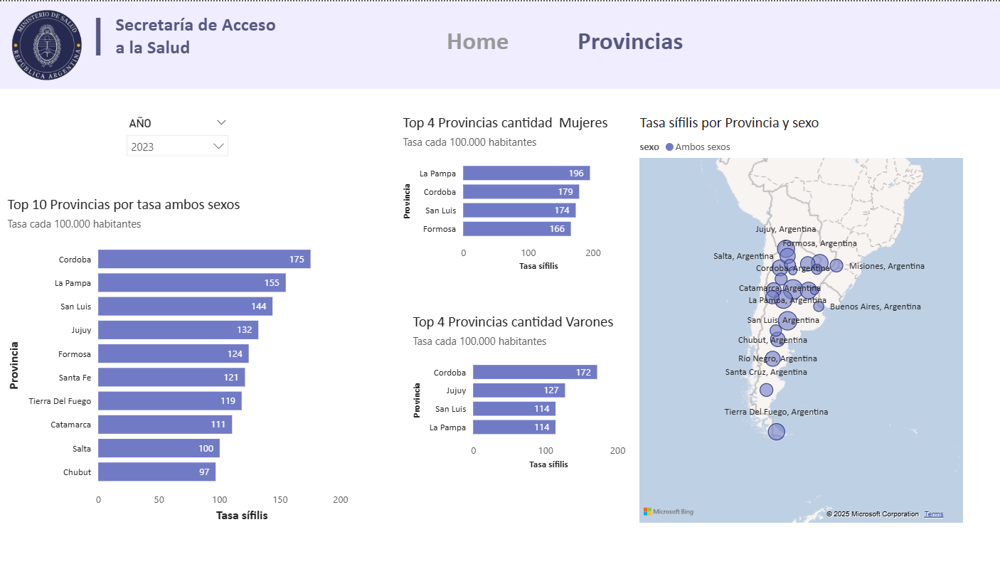
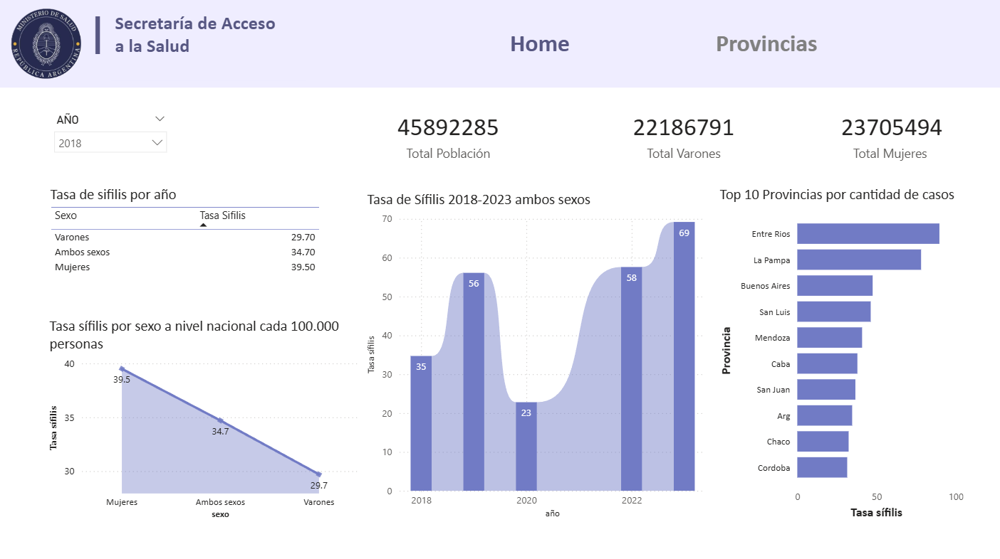

# 📊 Análisis de Sífilis en Argentina (2019–2023)

##  Descripción del proyecto

Este proyecto de **Data Analytics** analiza la evolución de los **casos y tasas de sífilis en Argentina** desde el año **2019 hasta 2023**, con un enfoque tanto **nacional** como **provincial**, incorporando además la **segmentación por sexo** (mujeres, varones y ambos sexos).

El objetivo principal es **visualizar, comprender y comunicar** cómo se comportó la tasa de sífilis a lo largo del tiempo, identificar **tendencias**, **diferencias regionales** y **brechas por sexo**, facilitando la toma de decisiones y el análisis epidemiológico.

Realice sugerencias .Las encontras detalladas en el PDF de mi Porfolio web https://judithpython.pythonanywhere.com/inicio/ 

---

##  Objetivos

* Analizar la evolución temporal de la tasa de sífilis en Argentina.
* Comparar los valores a nivel **nacional vs. provincial**.
* Visualizar diferencias por **sexo**: mujeres, varones y ambos sexos.
* Identificar provincias con mayores tasas.
* Facilitar una lectura clara mediante un **dashboard interactivo**.

---

##  Alcance del análisis

* **Período:** 2019 – 2024 ( no hay registros del año 2021 debido a que el sistema de salud estuvo enfocado casi exclusivamente en COVID. )
* **Jurisdicción:** Argentina (total país y provincias)
* **Variables clave:**

  * Año
  * Provincia 
  * Sexo
  * Tasa de sífilis

---

##  Herramientas utilizadas
* **Google colab Python**  → Limpieza y unificacion cvs
* **Power BI Desktop** → Modelado, medidas DAX y visualizaciones
* **Excel / CSV** → Fuente de datos
* **GitHub** → Versionado y documentación del proyecto

---

## 📊 Dashboard

El dashboard permite:

* Filtrar por **año**.
* Visualizar la **tasa nacional** separada por año.
* Comparar tasas entre provincias.
* Analizar diferencias entre mujeres, varones y en ambos sexos.

El dashboard fue diseñado priorizando la **claridad visual** de lso resultados.

---

##  Principales insights esperados

* Tendencias crecientes o decrecientes en el período analizado.
* Provincias con comportamientos atípicos.
* Diferencias significativas según sexo.
* Impacto temporal de determinados años sobre la tasa nacional.

---

##  Contexto del proyecto

Este proyecto forma parte de mi **portfolio personal**, orientado a demostrar habilidades en:

* Limpieza y modelado de datos
* Consolidacion de diferentes csv en uno solo
* Creación de medidas DAX
* Análisis exploratorio
* Visualización de datos
* Comunicación efectiva de resultados

---

##  Nota

Los datos utilizados tienen fines **educativos y analíticos** para  sumar al porfolio personal.

*Proyecto realizado con foco en el análisis y ver ocn claridad los resultados.*

El análisis por género evidencia no solo una problemática sanitaria, sino también desigualdades en el acceso y uso del sistema de salud, lo que impacta directamente en la calidad y representatividad de los datos(
El registro por género puede incluir:

Mujeres cis

Mujeres trans

Travestis

Personas que se autoperciben mujeres
).
